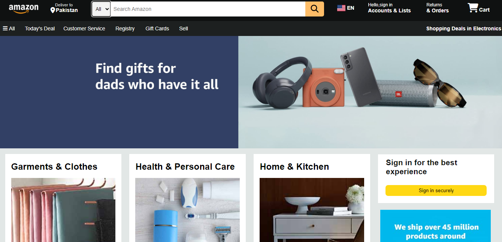

# AmazonClone - A Pure HTML and CSS Amazon Clone

This repository contains a project that replicates the appearance and layout of Amazon's website using only HTML and CSS. It's a static clone that emulates key components of the Amazon website, such as the navigation bar, hero section, shop section, and footer.

## Preview



## Features

- **Navigation Bar:** Replicates Amazon's top navigation bar with links to various sections and interactive elements.

- **Search Functionality:** Provides a search bar with a dropdown menu to filter search categories.

- **Shop Section:** Displays a variety of product boxes categorized into different sections, each with a unique image and link.

- **Hero Section:** Showcases a prominent image in the hero section, resembling Amazon's homepage layout.

- **Footer:** Emulates Amazon's footer with links to different sections and legal information.

## How to Use

1. Clone the repository using the following command:
   ```sh
   git clone https://github.com/MuhammadAmmarAtique/AmazonClone

2. Open the index.html file in your web browser to view the AmazonClone project.

**Dependencies:**
The project uses the following external resources:

Font Awesome Icons - Icons for various elements in the navigation bar and footer.

**Contributing:**
This project was created as a learning exercise to practice HTML and CSS. If you have ideas to enhance it or find any issues, feel free to open a pull request or an issue.

**License:**
This project is licensed under the MIT License.

**Disclaimer:** This project is intended for educational purposes only and is not affiliated with Amazon in any way.

**Feel free to customize and improve upon the project to further develop your HTML and CSS skills!**


**Remember to replace the placeholder URLs with the actual URLs of the resources you used in your project.**

